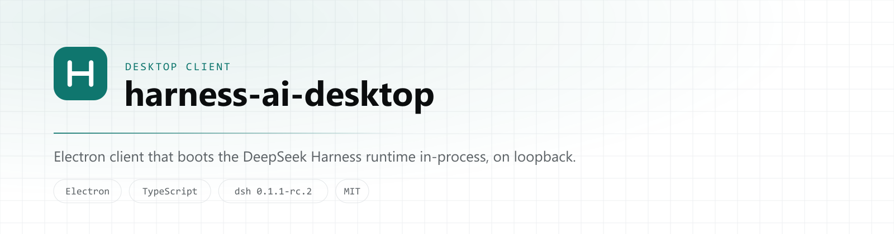
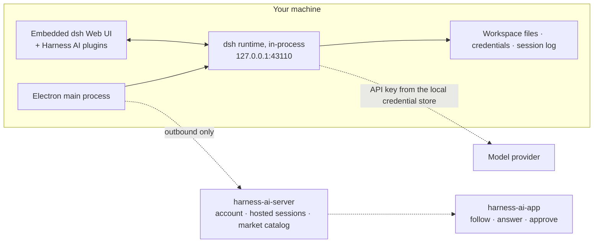

<p align="center">
  <picture>
    <source media="(prefers-color-scheme: dark)" srcset="docs/assets/desktop-banner-dark.png">
    <source media="(prefers-color-scheme: light)" srcset="docs/assets/desktop-banner-light.png">
    
  </picture>
</p>

<p align="center">
  <a href="https://github.com/harness-home/harness-ai-desktop/actions/workflows/ci.yml"></a>
  <a href="LICENSE"></a>
  
  
  
  
  <a href="https://github.com/deepseek-ai/deepseek-harness"></a>
</p>

<p align="center">
  <b>English</b> · <a href="README.zh-CN.md">简体中文</a>
</p>

<p align="center">
  <a href="#how-it-works">How it works</a> · <a href="#what-it-does">Features</a> · <a href="#security-model">Security</a> · <a href="#building-from-source">Build</a> · <a href="#project-layout">Layout</a> · <a href="#roadmap">Roadmap</a>
</p>

---

**harness-ai-desktop** is the desktop client of [Harness AI](https://github.com/harness-home): a Codex / Claude Code–style agent workbench built on [DeepSeek Harness](https://github.com/deepseek-ai/deepseek-harness) (`dsh`).

The agent runtime runs **inside this app, on your machine** — in the Electron main process itself, bound to loopback, with no inbound port. The client adds what an agent runtime does not ship: an account, hosted session history that follows you to your phone, remote approvals, and a plugin market with a supply-chain gate in front of it.

> [!IMPORTANT]
> **Developer preview.** The upstream runtime is a developer preview and states that breaking changes are expected; this client tracks it at a pinned version. No installers are published yet — see [Building from source](#building-from-source).

## How it works



Three properties hold that diagram together:

1. **The runtime never listens outside loopback.** Everything the mobile client sees is there because *this* client pushed it out over an outbound connection. Nothing dials in.
2. **The shell talks to the runtime through one narrow adapter** (`HarnessAdapter`), and to the hosted service through the local `/api` surface — it never reaches into `dsh` internals, which keeps an upstream upgrade a version bump rather than a rewrite.
3. **Our own features are plugins.** Branding, the account panel, the market panel, the native directory picker and the Windows sandbox runner are Cordis plugins layered onto the upstream profile — the same extension mechanism third-party plugins use.

## What it does

### Runtime hosting

| | |
| --- | --- |
| **In-process boot** | Composes a desktop profile from the official bundle layers and boots the `dsh` Host inside the Electron main process — no child runtime, no second Node installation. |
| **Loopback binding** | Binds `127.0.0.1:43110`; an occupied port moves to the next free one, up to 20 probes. |
| **Version pinning** | Every `@deepseek-ai/*` package is referenced through a pnpm catalog, so an upstream upgrade is a one-line change (`pnpm dsh:version`) instead of an edit across thirty dependency entries. |
| **Electron host fixes** | Two upstream code paths spawn Node through `process.execPath`, which under Electron means *a second copy of the app*. Both are corrected at the seam: a `child_process` shim for the native directory-picker worker, and a trampoline for the Windows ACL PowerShell sandbox runner. |

### Account, hosted sessions and remote control

| | |
| --- | --- |
| **Sign-in** | Account sign-in from inside the app; each device carries its own identity and can be revoked server-side. |
| **Session hosting** | Local session events are mirrored to `harness-ai-server`, so the same conversation can be read and continued from the mobile client. |
| **Client-side redaction** | Credential-shaped strings are masked *before* upload, sessions whose working directory hits the denylist are never synced, and large blobs never ride the event channel. |
| **Attachments** | Images the agent produced are content-addressed (`sha256:…`), uploaded on a channel of their own behind the events, deduplicated per account and capped by a server-side quota. |
| **Remote approvals and prompts** | A tool that steps outside the workspace raises an approval instead of executing. Settle it at the desk, or from your phone. Prompts sent while the desktop is offline are queued server-side and drained on reconnect. |

### Plugin market, with a supply-chain gate

The runtime's permission system governs tool calls, not the code a plugin ships. So every defence sits **before** installation:

- **Risk flags** on each catalog entry — install scripts, native build, no provenance, no license, low adoption, new package.
- **A disclosure gate** in front of every install, including installs handed over from the website via `harness-ai://install?listing=<id>`, stating plainly that a plugin runs with the same access as the client itself.
- **An integrity re-check** against the registry before anything is written: the integrity hash the catalog recorded must still match. This closes the hole a pinned version number leaves open — the same version can be republished with different bytes.
- **`--ignore-scripts`, written explicitly**, never inherited from a config file that might drift.
- **Capability inspection** after install, reporting what the package actually reaches for: network, file writes, native modules.
- **An install journal** that records the profile manifest before every change and restores it after a failure or a crash — restoring the manifest text only, never deleting `node_modules`.

### Reliability

Single-instance lock · crash audit of the previous run · secret-masked file logs · system tray · a recovery page (retry / open logs / quit) when boot fails · in-app updates that never install behind your back · and a boot watchdog that measures **progress** rather than wall-clock time (20 s without progress, 180 s absolute), so a slow machine is not mistaken for a hung one.

## Security model

| Line | Guarantee |
| --- | --- |
| Loopback only | The runtime binds `127.0.0.1`. No inbound connection reaches your machine — not from the server, not from the phone. |
| Model keys stay local | API keys live in the `dsh` credential store on your machine and are never uploaded. |
| Redaction before upload | Masking and the working-directory denylist run client-side, so the hosted service never receives what was filtered out. |
| Approvals are explicit | Work outside the workspace needs a human answer, and every decision is auditable. |
| Installs are disclosed | Nothing is installed without a gate that names the risk, and the website can only hand over a catalog id — never a package name and version. |

Found a vulnerability? See [SECURITY.md](https://github.com/harness-home/.github/blob/main/SECURITY.md).

## Building from source

**Prerequisites** — Node `^22.19.0 || >=24`, pnpm 11, Windows x64 (the only packaged target today), and a DeepSeek API key for anything that talks to a model.

> **Workspace note.** This repository shares a typed contract package (`@harness-ai/contracts`) with the mobile client and the hosted service, resolved as a sibling directory. Clone it next to this repository before installing:
>
> ```
> harness-home/
>   harness-ai-desktop/     ← this repository
>   harness-ai-packages/    ← provides @harness-ai/contracts
> ```

```bash
pnpm install          # postinstall fetches the Electron binary
pnpm typecheck
pnpm test             # 127 unit tests, offline
pnpm dev              # build the in-repo plugins, then run the shell
```

| Command | What it does |
| --- | --- |
| `pnpm dev` | Generate icons → build in-repo plugins → `electron-vite dev`. |
| `pnpm build` | Production build of main / preload / renderer plus the plugins. |
| `pnpm typecheck` | `tsc --noEmit`; must be clean. |
| `pnpm test` | The Vitest unit suite — offline and fast by design. |
| `pnpm test:e2e` | The suite that needs the network or a real registry: plugin installs, hosted-attachment round trip. |
| `pnpm dist:win` | NSIS installer into `dist/`, behind a third-party-notice gate and an `afterPack` check. |
| `pnpm smoke:packaged` | Boot the packaged app and assert the loopback endpoint, the runtime page and the brand plugin. |
| `pnpm dsh:version` | Move every pinned `dsh` package to a new upstream version in one step. |

The release checklist, including the manual passes, is in [docs/acceptance.md](docs/acceptance.md).

## Project layout

```
src/main/            Electron main: boot, tray, updater, crash audit, logging, deep links
  harness/           The dsh seam — adapter, boot, hosting bridge, market and install guard
  account/           Account service and device identity
src/preload/         Context-isolated bridge to the renderer
src/renderer/        Shell chrome around the embedded runtime UI
src/shared/          i18n (en-US / zh-CN) and the shell API types
plugins/
  brand/                      Product identity inside the runtime UI (tray, theme, sidebar)
  account-ui/                 Sign-in and device panel
  market-ui/                  Plugin market panel, risk chips and the install gate
  electron-directory-picker/  Native workspace picker
  windows-pwsh-sandbox/       Windows ACL sandbox runner, corrected for the Electron host
scripts/             Icon generation, packaging checks, smoke and acceptance drivers
```

## Roadmap

| | |
| --- | --- |
| ✅ Shipped | In-process runtime hosting · account and device identity · hosted session sync · attachment sync · remote approvals and queued prompts · plugin market with the install gate · Windows packaging |
| 🚧 In progress | Published installers and a stable update feed |
| 📋 Planned | macOS packaging and code signing · a second harness behind the same adapter, if and when one earns its place |

## Contributing

Issues and pull requests are welcome — start with [CONTRIBUTING.md](https://github.com/harness-home/.github/blob/main/CONTRIBUTING.md). It covers the commit conventions, the English-only source rule, and how a change to upstream behaviour is expected to be staged: plugin first, upstream patch last.

## Acknowledgements

Built on [DeepSeek Harness](https://github.com/deepseek-ai/deepseek-harness) (MIT) and [Cordis](https://github.com/deepseek-ai/cordis). Third-party notices for a packaged build are generated at release time into `THIRD_PARTY_NOTICES.md`.

## License

[MIT](LICENSE) © harness-home
