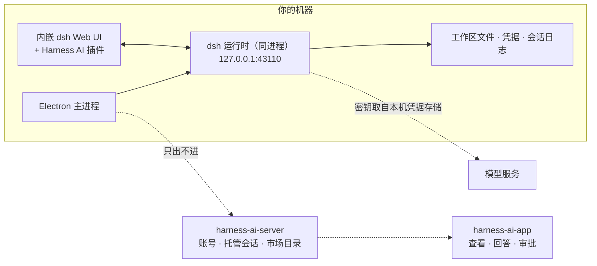

<p align="center">
  <picture>
    <source media="(prefers-color-scheme: dark)" srcset="docs/assets/desktop-banner-dark.png">
    <source media="(prefers-color-scheme: light)" srcset="docs/assets/desktop-banner-light.png">
    
  </picture>
</p>

<p align="center">
  <a href="LICENSE"></a>
  
  
  
  
  <a href="https://github.com/deepseek-ai/deepseek-harness"></a>
</p>

<p align="center">
  <a href="README.md">English</a> · <b>简体中文</b>
</p>

---

**harness-ai-desktop** 是 [Harness AI](https://github.com/harness-home) 的桌面客户端：基于 [DeepSeek Harness](https://github.com/deepseek-ai/deepseek-harness)（`dsh`）的类 Codex / Claude Code 桌面 Agent 工作台。

Agent 运行时**跑在这个应用里、跑在你自己的机器上**——就在 Electron 主进程内，只绑定回环地址，不开放任何入站端口。客户端补上的是运行时本身不提供的部分：账号、能跟到手机上的托管会话、远程审批，以及一个前置了供应链闸门的插件市场。

> **开发者预览。** 上游运行时处于 developer preview，官方明示会有破坏性变更；本客户端以固定版本跟随。目前尚未发布安装包，请见[从源码构建](#从源码构建)。

## 工作原理



支撑这张图的三条性质：

1. **运行时不在回环之外监听。** 手机端能看到的一切，都是*这个客户端*主动向外推送的结果；没有任何连接是拨进来的。
2. **壳只经一层窄适配（`HarnessAdapter`）对接运行时**，经本地 `/api` 对接托管服务，不碰 `dsh` 内部实现——这样升级上游是改版本号，而不是重写。
3. **我们自己的功能也是插件。** 品牌、账号面板、市场面板、原生目录选择器、Windows 沙箱执行器都是叠加在上游 profile 上的 Cordis 插件，用的是和第三方插件同一套扩展机制。

## 功能

### 运行时托管

| | |
| --- | --- |
| **同进程启动** | 用官方 bundle 分层组合出桌面 profile，在 Electron 主进程内启动 `dsh` Host——没有子运行时，也不需要第二个 Node。 |
| **回环绑定** | 绑定 `127.0.0.1:43110`；端口被占用则顺延到下一个空闲端口，最多探测 20 次。 |
| **版本钉死** | 所有 `@deepseek-ai/*` 依赖统一走 pnpm catalog，升级上游是**一行改动**（`pnpm dsh:version`），而不是逐条改三十个依赖。 |
| **Electron 宿主修复** | 上游有两处用 `process.execPath` 拉起 Node，在 Electron 下等于*再开一个应用实例*。两处都在接缝上修好：原生目录选择器 worker 走 `child_process` 注入，Windows ACL PowerShell 沙箱执行器走 trampoline。 |

### 账号、托管会话与远程控制

| | |
| --- | --- |
| **登录** | 应用内登录；每台设备有独立身份，可在服务端吊销。 |
| **会话托管** | 本地会话事件镜像到 `harness-ai-server`，同一段对话可在手机端查看并接续。 |
| **上传前脱敏** | 密钥形状的字符串在上传**之前**遮蔽；工作目录命中 denylist 的会话根本不同步；大块字节不走事件通道。 |
| **附件** | Agent 产出的图片按内容寻址（`sha256:…`），走独立通道排在事件之后上传，按账号去重并受服务端配额约束。 |
| **远程审批与指令** | 越出工作区的工具调用会先发起审批而不是直接执行——在桌面前处理，或者在手机上处理。桌面离线期间发来的指令由服务端暂存，重连即投递。 |

### 插件市场与供应链闸门

运行时的权限体系管的是工具调用，不是插件带来的代码。所以所有防线都前移到**安装之前**：

- 每个目录条目上的**风险标记**：安装期脚本、原生构建、无来源证明、无许可证、低采用率、新包。
- 每次安装前的**告知闸门**——包括网页经 `harness-ai://install?listing=<id>` 交接过来的安装——明说插件拥有与客户端相同的访问权限。
- 写入任何文件之前，回注册表**复核完整性摘要**：目录记录的 integrity 必须仍然对得上。**这一步补的正是版本号钉死补不上的洞**——同一个版本号可以被重新发布，字节已经变了。
- **显式写出 `--ignore-scripts`**，不依赖某个可能被改动的配置文件。
- 安装完成后**扫描实际能力**并回报：网络访问、写文件、原生模块。
- **安装日志**：每次改动前先把 profile manifest 原文入日志，失败或崩溃后整份还原——**只还原 manifest 文本，不删 `node_modules`**。

### 可靠性

单实例锁 · 上次运行的崩溃审计 · 脱敏后的文件日志 · 系统托盘 · 启动失败时的恢复页（重试 / 打开日志 / 退出） · 绝不背着用户安装的应用内更新 · 以及一个按**进度**而不是按墙钟计时的启动看门狗（20 秒无进度 / 180 秒绝对上限），免得把慢机器当成卡死。

## 安全模型

| 红线 | 保证 |
| --- | --- |
| 只走回环 | 运行时绑定 `127.0.0.1`。没有任何入站连接能到达你的机器——服务端不能，手机也不能。 |
| 模型密钥不出本机 | API Key 存在本机的 `dsh` 凭据存储里，永不上传。 |
| 上传前脱敏 | 遮蔽与工作目录 denylist 都在客户端执行，被过滤掉的内容托管服务根本收不到。 |
| 审批必须显式 | 越出工作区的动作需要人来回答，且每个决定都可审计。 |
| 安装必须告知 | 没有闸门就不会安装；网页只能交接一个目录 id，指定不了包名和版本。 |

发现安全问题请看 [SECURITY.md](https://github.com/harness-home/.github/blob/main/SECURITY.md)。

## 从源码构建

**前置条件** —— Node `^22.19.0 || >=24`、pnpm 11、Windows x64（目前唯一的打包目标），以及一个 DeepSeek API Key（凡是要接模型的环节都需要）。

> **工作区说明。** 本仓库与移动端、服务端共用一个类型契约包（`@harness-ai/contracts`），按同级目录解析。安装依赖前请把它克隆在本仓库旁边：
>
> ```
> harness-home/
>   harness-ai-desktop/     ← 本仓库
>   harness-ai-packages/    ← 提供 @harness-ai/contracts
> ```

```bash
pnpm install          # postinstall 拉取 Electron 二进制
pnpm typecheck
pnpm test             # 127 项单测，离线
pnpm dev              # 先构建仓内插件，再启动壳
```

| 命令 | 作用 |
| --- | --- |
| `pnpm dev` | 生成图标 → 构建仓内插件 → `electron-vite dev`。 |
| `pnpm build` | main / preload / renderer 与插件的生产构建。 |
| `pnpm typecheck` | `tsc --noEmit`，必须零错误。 |
| `pnpm test` | Vitest 单测——刻意保持离线且快。 |
| `pnpm test:e2e` | 需要网络或真实 registry 的验证：插件安装、托管附件全链路。 |
| `pnpm dist:win` | 产出 NSIS 安装包到 `dist/`，前置第三方声明闸门与 `afterPack` 硬校验。 |
| `pnpm smoke:packaged` | 启动打包产物，断言回环端点、运行时页面与品牌插件。 |
| `pnpm dsh:version` | 一步把所有钉死的 `dsh` 依赖切到新的上游版本。 |

完整发版清单（含人工步骤）见 [docs/acceptance.md](docs/acceptance.md)。

## 目录结构

```
src/main/            Electron 主进程：启动、托盘、更新、崩溃审计、日志、深链
  harness/           dsh 接缝——适配层、启动、托管桥、市场与安装闸门
  account/           账号服务与设备身份
src/preload/         上下文隔离的渲染进程桥
src/renderer/        包住内嵌运行时 UI 的壳
src/shared/          i18n（en-US / zh-CN）与壳 API 类型
plugins/
  brand/                      运行时 UI 内的产品标识（托盘、主题、侧栏）
  account-ui/                 登录与设备面板
  market-ui/                  插件市场面板、风险标记与安装闸门
  electron-directory-picker/  原生工作区选择器
  windows-pwsh-sandbox/       Windows ACL 沙箱执行器（已适配 Electron 宿主）
scripts/             图标生成、打包校验、冒烟与验收驱动脚本
```

## 路线图

| | |
| --- | --- |
| ✅ 已完成 | 同进程运行时托管 · 账号与设备身份 · 托管会话同步 · 附件同步 · 远程审批与指令排队 · 带安装闸门的插件市场 · Windows 打包 |
| 🚧 进行中 | 对外发布安装包与稳定的更新源 |
| 📋 计划中 | macOS 打包与代码签名 · 若确有必要，在同一层适配下接入第二种 harness |

## 参与贡献

欢迎提 issue 和 PR，请先读 [CONTRIBUTING.md](https://github.com/harness-home/.github/blob/main/CONTRIBUTING.md)：提交约定、源码全英文规则，以及涉及上游行为的改动应当如何分级（先插件，补丁层放最后）。

## 致谢

构建于 [DeepSeek Harness](https://github.com/deepseek-ai/deepseek-harness)（MIT）与 [Cordis](https://github.com/deepseek-ai/cordis) 之上。打包产物的第三方声明在发版时生成到 `THIRD_PARTY_NOTICES.md`。

## 许可

[MIT](LICENSE) © harness-home
